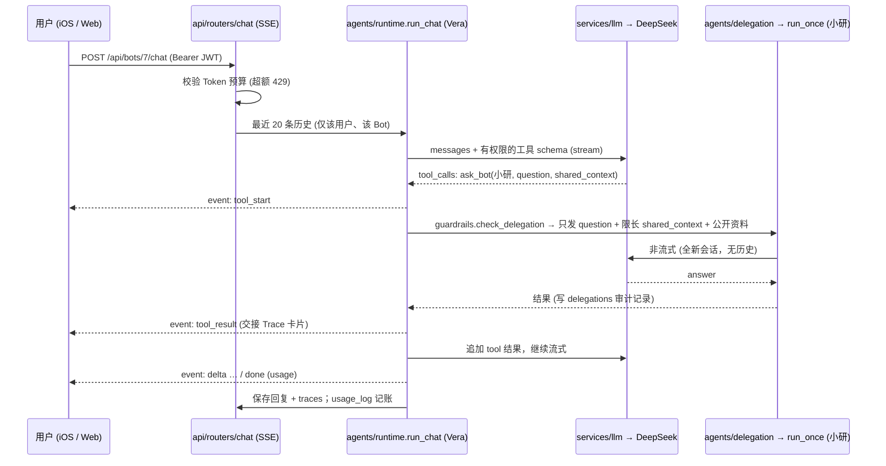
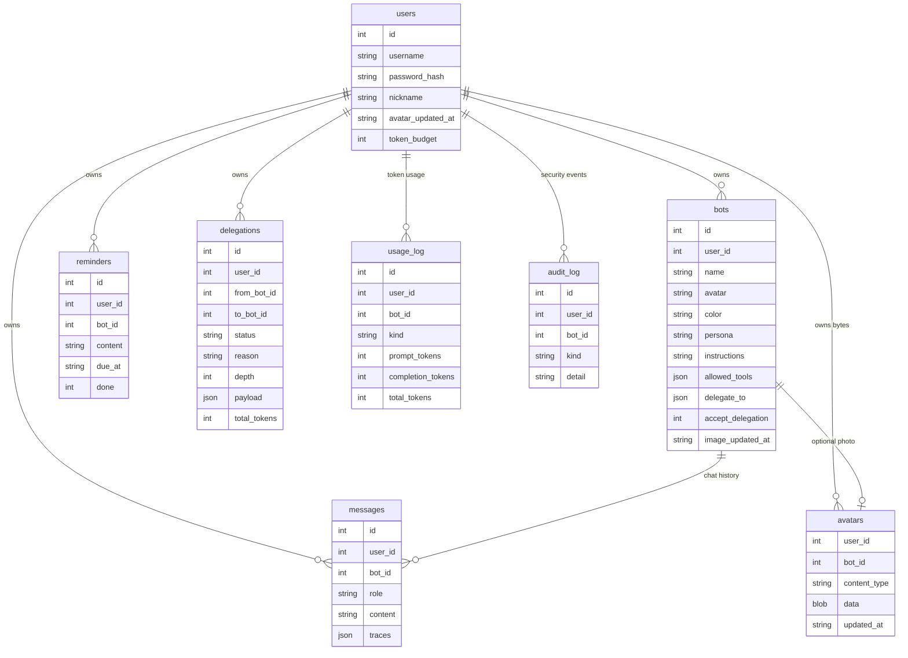

# VeraBot 架构说明 (Architecture) — v0.1.0

## 1. 总览：两个可独立交付的项目

```
                      HTTP/JSON + SSE (JWT Bearer)
frontend/ios  (SwiftUI) ─┐
                         ├──────────────▶ backend (FastAPI · uvicorn :8000) ──▶ DeepSeek API (deepseek-chat)
frontend/web  (SPA)  ────┘                    │                             ├─▶ Open-Meteo (天气)
                                              ▼                             └─▶ OpenAI Audio (可选，语音转写)
                                     SQLite backend/data/verabot.db
```

| 项目 | 交付物 | 依赖管理 | 与另一方的关系 |
|---|---|---|---|
| `backend/` | 目录或 `dist/VeraBot-backend-v0.1.0.zip` (`start.command` / `start.sh` 一键启动；可选 Docker) | uv：`pyproject.toml` + `uv.lock` (+ `requirements.txt` 导出) | 只提供 HTTP API；可选托管 `frontend/web` 静态文件 (`VERABOT_WEB_DIR`) |
| `frontend/ios` | Xcode 工程 `VeraBot.xcodeproj` + 本地包 `Packages/VeraBotKit` | SPM (无第三方依赖) | 只通过 API 访问后端，服务器地址可在登录页配置 |
| `frontend/web` | 3 个静态文件 | 无 | 同源调用 `/api/*` |

规则：**前端不 import 后端代码，后端不依赖前端代码** (Web 目录不存在时 `/` 只返回 API 信息)。接口契约 = OpenAPI (`/docs`) + SSE 事件格式 (见 [FEATURES.md](../product/FEATURES.md#api-摘要))。

## 2. 后端 (backend/verabot)

### 2.1 模块

| 包 | 职责 | 主要文件 |
|---|---|---|
| `core` | 配置 (环境变量)、安全 (bcrypt + JWT) | `config.py`、`security.py` |
| `db` | SQLite 连接 / 事务、建表与幂等迁移 (schema v2)、查询 | `database.py`、`schema.py`、`repository.py` |
| `tools` | 工具注册表 (`@tool`、schema 导出、安全执行) 和内置工具 | `registry.py`、`weather.py`、`reminder.py` |
| `services` | 外部服务与业务逻辑：LLM 客户端、语音转写、Bot 权限校验、用量统计、用户资料、头像处理 | `llm.py`、`transcribe.py`、`bots.py`、`quota.py`、`users.py`、`avatars.py` |
| `agents` | Agent Loop 与多 Agent：system prompt、权限、护栏、上下文隔离、`ask_bot` 委派 | `runtime.py`、`prompts.py`、`permissions.py`、`guardrails.py`、`context.py`、`delegation.py` |
| `api` | HTTP 层：鉴权依赖、pydantic 模型、路由 | `deps.py`、`schemas.py`、`routers/{auth,avatars,bots,chat,voice,reminders,meta}.py` |
| `main.py` | 组装 FastAPI app：CORS、422 处理、启动 `init_db`、挂载路由、托管 Web | — |

### 2.2 依赖规则 (Dependency rules)

```
main ──▶ api ──▶ services ──▶ db ──▶ core
          │         ▲          ▲
          └──▶ agents ──▶ tools ┘
```

- 只允许**向下**依赖：`api → services / agents → tools / db → core`。`core` 不依赖任何内部包；`db` 只依赖 `core`。
- HTTP 细节 (FastAPI、`HTTPException`、pydantic 请求模型) 只出现在 `api/` 和 `main.py`。
- 模块通过包引用调用 (`from ..services import llm` → `llm.complete(...)`)，测试可以直接替换 (monkeypatch) 模块属性，例如 `multi_agent_test.py` 用 mock LLM 替换 `llm.stream_chat`。
- 两处**有意的例外** (插件注册，都有注释)：
  1. `tools/__init__.py` 导入 `agents.delegation`，让 `ask_bot` 按原顺序注册到工具表 (`get_weather`、`create_reminder`、`list_reminders`、`ask_bot`)。
  2. `tools/registry.run_tool` 在函数内延迟导入 `agents.permissions.is_permitted` (执行前的二次权限检查)，避免循环导入。
- 新增工具：在 `tools/` 新建模块并用 `@tool` 注册，在 `tools/__init__.py` import；权限白名单 `ALL_TOOLS_V2` 在 `db/schema.py`。

### 2.3 一次对话的时序 (含多 Agent 委派)



### 2.4 数据模型



另有 `transcriptions` (Web 语音转写计数，用于用量看板) 和 `avatars` (用户 / Bot 的 512 JPEG)。`schema_meta` 记录 schema 版本；`init_db()` 建表并做幂等迁移 (v1 → v2 → v3)。v3 只加列和头像表，不改 v2 的权限回填。详见下文「资料与头像」。

## 3. iOS 客户端 (frontend/ios)

### 3.1 模块

```
VeraBot (App target, SwiftUI)                    Packages/VeraBotKit (本地 Swift Package)
├── App/        入口、AppState、AppConfig          ├── VeraBotCore        模型 (Codable)、SettingsKeys   ← 无依赖
├── Core/UI/    Theme、BotAvatar、UserAvatar、     ├── VeraBotNetworking  VeraBotAPI 协议 + APIClient     → Core
│               AvatarPicker、LiveBotAvatar      │                      （含头像 multipart / 字节下载）
├── Features/   Auth · BotList · BotInfo · Chat    └── VeraBotTTS         TTSEngine 协议 + SpeechPlayer  → Core
│               Settings · Reminders · Quota
└── Services/   Keyboard、Speech (语音输入)、Avatar (AvatarStore)
```

依赖规则：

- `VeraBotCore` 不依赖其他模块、不含 UI；`VeraBotNetworking`、`VeraBotTTS` 只依赖 Core，二者互不依赖。
- App 依赖 Kit，Kit 不依赖 App。App 持有**协议**：`AppState.api: any VeraBotAPI`、`ChatViewModel` 通过 `VeraBotAPI` 访问网络，TTS 通过 `TTSEngine` 分派，便于注入 mock。
- Features 之间不直接互相引用状态，只通过 `AppState` (`@Observable`，`.environment` 注入) 和导航传参。
- 放进 Kit 的标准：与 SwiftUI 视图无关、可单元测试、可能被其他 target (Widget / 扩展) 复用。视图和交互留在 App。
- Swift 6 语言模式 + 严格并发 (`SWIFT_STRICT_CONCURRENCY = complete`)；Kit 的公开类型都是 `Sendable` 或 `@MainActor`。

### 3.2 工程

- `VeraBot.xcodeproj` 使用文件夹同步组 (PBXFileSystemSynchronizedRootGroup)：`VeraBot/` 下新增 / 移动文件无需改工程文件。
- 本地包通过 `XCLocalSwiftPackageReference (relativePath = Packages/VeraBotKit)` 引用，产品 VeraBotCore / VeraBotNetworking / VeraBotTTS 链接到 App target。
- `project.yml` 是等价的 xcodegen 描述 (备用)。

## 4. 依赖管理选择 (Dependency management)

| | 选择 | 理由 | 不选 |
|---|---|---|---|
| iOS | **Swift Package Manager (SPM)** | Xcode 原生、无需额外工具和 `Podfile` / workspace；本地包可以把核心代码模块化，并用 `swift test` 在 Mac 上测试；以后加第三方包只需在 `Package.swift` 或 Xcode「Package Dependencies」里声明，版本记录在 `Package.resolved` | CocoaPods (额外 Ruby 工具链、修改工程文件、已进入维护模式)、Carthage |
| 后端 | **uv** (`pyproject.toml` + `uv.lock`) | 一个工具管理 Python 版本 + 虚拟环境 + 依赖；锁文件跨平台、`uv sync --frozen` 可复现；安装速度快；支持镜像 (`UV_INDEX_URL`、`UV_PYTHON_INSTALL_MIRROR`)，适合国内网络 | 仅 pip + requirements.txt (没有传递依赖锁、没有 Python 版本管理)、Poetry (更慢、交付时需要额外安装) |
| 后端回退 | `requirements.txt` (由 uv.lock 导出，版本全部锁定) | 没有 uv 或官方源不可用时，`start.sh` 用清华 tuna 镜像 `uv pip install -r requirements.txt`；也可以直接 `pip install -r` | — |
| 部署 (可选) | Dockerfile + docker-compose (`python:3.12-slim` + `uv sync --frozen`) | 服务器部署；数据目录挂载 `./data` | — |

当前版本锁定：Python 3.12；fastapi 0.142.1、uvicorn 0.54.0、httpx 0.28.1、pyjwt 2.15.1、bcrypt 5.0.0、python-multipart 0.0.32、pillow 11.3.0 (共 45 个包，见 `uv.lock`)。iOS 无第三方依赖；工具链 Xcode 26.0.1 / Swift 6.2，部署目标 iOS 17.0。

## 6. 资料与头像 (Profile & avatars) — schema v3

启动时 `init_db()` 幂等执行。已有库从 v2 升到 v3 时**不会**重跑 v2 的「存量 Bot 授予全部工具」逻辑。

### 6.1 表

| 列 / 表 | 含义 |
|---|---|
| `users.nickname` | 可空。NULL 或空白 = 未设置，`display_name` 回退 `username` |
| `users.avatar_updated_at` | 可空。非空表示有自定义用户头像 |
| `bots.avatar` | 原有 emoji，不变 |
| `bots.image_updated_at` | 可空。非空表示该 Bot 有照片（API 字段名仍是 `has_avatar` / `avatar_updated_at`） |
| `avatars` | 主键 `(user_id, bot_id)`。`bot_id = 0` 是用户自己的头像；正数是 Bot id。`data` 为 JPEG BLOB，`content_type` 固定 `image/jpeg`。用户删除时随 `users` 级联；Bot 删除时由触发器 `avatars_delete_with_bot` 删掉对应行 |

公开 JSON（`services/users.public_user`、`services/bots.public_bot`）不包含 `password_hash` 和图片字节。图片只走下面的 GET。

### 6.2 HTTP

均需 Bearer JWT。用户头像没有 user id 路径，只能操作当前 token。Bot 头像先 `require_bot`（他人与不存在都是 404），再按 `user_id` 读写。

| 方法 | 路径 | 行为 |
|---|---|---|
| PATCH | `/api/me` | body `{nickname}`。`clean_nickname`：strip、非空、≤ 32 个字、拒绝控制字符。422 文案不带 pydantic 前缀 |
| POST | `/api/me/avatar`、`/api/bots/{id}/avatar` | `multipart/form-data`，字段名 `file`。不信任 Content-Type，只看文件头：JPEG / PNG / WebP；HEIC 能识别，未装 `pillow-heif` 时 415。大于 8MB → 413。解码失败 → 400。处理：EXIF 转正、居中裁正方形、512×512、JPEG quality 85。成功返回更新后的 user 或 bot |
| GET | 同上路径 | `image/jpeg`。没有自定义头像 → 404「未设置头像」，客户端显示首字或 emoji |
| DELETE | 同上路径 | 删 BLOB 并清空时间戳，返回更新后的 user 或 bot（Bot 的 emoji 还在） |

常量在 `services/avatars.py`：`MAX_AVATAR_BYTES = 8 MiB`，`AVATAR_SIZE = 512`。不新增环境变量。

iOS 在上传前用 `AvatarImage.jpegData` 把照片收成边长 1024 的 JPEG（相册里的 HEIC 由系统 `UIImage` 解码后再编码）。圆形预览用系统 sheet，显示区域与服务端中心裁切一致。昵称和用户头像放在 `AppState`；Bot 照片放在 `AvatarStore`。设置页保存后，首页工具栏和对话里的用户昵称读的是同一份 `displayName`，不会各刷各的接口。

## 5. 关键设计决策

| 主题 | 决策 | 理由 |
|---|---|---|
| 模型接入 | 服务端统一持有 `DEEPSEEK_API_KEY`，OpenAI 兼容协议 | 用户零配置；可切换其他 OpenAI 兼容模型 |
| 租户隔离 | 每条 SQL 带 `user_id`；他人资源返回 404 | 简单可审计，防枚举 |
| 记忆隔离 | 历史按 `(user_id, bot_id)` 存取 | Bot 之间人格与上下文互不串扰 |
| 多 Agent | Agent-as-a-Tool (`ask_bot`)，最小权限 + 服务端强制 + 上下文隔离 + 护栏 + 审计 | 可控、可观测；详见 MULTI_AGENT_DESIGN |
| 工具轮次 | 每轮最多 4 轮工具调用 (`VERABOT_MAX_TOOL_ROUNDS`) | 防止工具循环 |
| 流式协议 | SSE (`event:` + `data:` JSON) | 浏览器 `fetch` 与 iOS `URLSession.bytes` 都能直接解析 |
| 语音输入 | Web 走服务端转写，iOS 走系统 Speech；结果只填入输入框 | 用户确认后再发送，避免误发 |
| 存储 | SQLite (WAL) | 原型零运维；表结构可平移到 PostgreSQL |
